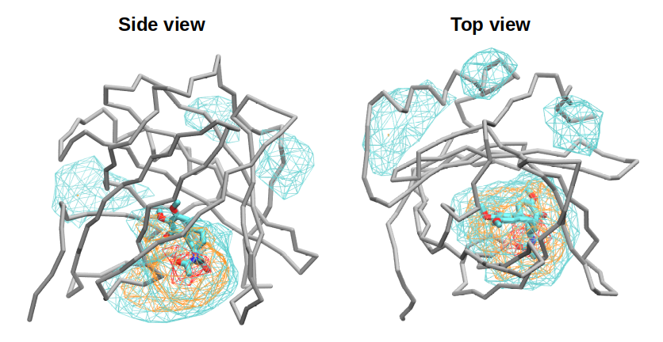
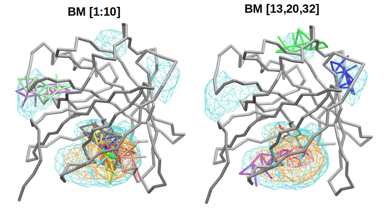

# Introduction

This README describes the application of the **TULIPAN** workflow to a set of coarse-grained molecular dynamics (CG-MD) trajectories modeling the binding of **colchicine** to **colchicalin** from the bulk solvent.

The example dataset consists of multiple independent CG-MD trajectories in which a single protein is simulated in the presence of **two colchicine molecules**, allowing spontaneous binding events to be sampled and analyzed. TULIPAN processes these trajectories to identify binding events, cluster them into distinct binding modes, estimate their populations and residence times, and extract representative structures for visualization.

The molecular system and simulation parameters used in this example are taken from the work of Grazzi *et al.*:

> Grazzi, A. *et al.* "Efficient Protein–Ligand Binding Free Energy Estimation with Coarse-Grained Funnel Metadynamics" *Journal of Chemical Theory and Computation* (2025). https://pubs.acs.org/doi/full/10.1021/acs.jctc.5c01785

This dataset is provided as an example of the expected input organization and to illustrate the complete TULIPAN analysis workflow, from trajectory processing to the visualization of representative binding modes.

## Downloading the Example Dataset

To keep the repository lightweight, the input trajectories and example output files are distributed separately as ZIP archives through [Zenodo](https://doi.org/10.5281/zenodo.21098229).

Download the following files from the Zenodo record:

* `input_data.zip` – input files, including the trajectories, reference files, and templates.
* `test_results.zip` – example output generated by the complete TULIPAN workflow.

Extract both archives in the root directory of the repository:

```bash
unzip input_data.zip
unzip test_results.zip
```

Alternatively, the archives can be extracted using any graphical archive manager.

After extraction, the repository should contain the directories required for the examples described in this README.
## Set PATH reference
Rename `_tulipan.sh` to `tulipan.sh` and `_tulipan_clust_assign.sh` to `tulipan_clust_assign.sh`
Substitute `/path/to` with the appropriate absolute path leading to your working folder

## Input Directory Structure

The worked example expects the following directory layout:

```text
project_dir/
├── figures/
├── list_traj.txt
├── reference_files/
├── trajectories/
└── templates/
```

### `list_traj.txt`

A plain text file containing the list of trajectories to analyze, with one trajectory path per line.

Example:

```text
trajectories/fit_r1_d1000.xtc
trajectories/fit_r2_d1000.xtc
...
trajectories/fit_r15_d1000.xtc
```

This file defines the trajectories that will be processed by the workflow. Using a list file allows analyses to be run on any subset of trajectories without modifying the scripts.

## `reference_files/`

This directory contains all reference structures and topology files required for GROMACS analyses.

Typical contents:

| File              | Description                                                                                            |
| ----------------- | ------------------------------------------------------------------------------------------------------ |
| `eqstrip.gro`     | Reference structure in GROMACS format of protein and ligand(s).                                        |
| `eqstrip.pdb`     | PDB version of the equilibrated reference structure (useful for visualization).                        |
| `eqstrip.tpr`     | GROMACS portable run input file used for trajectory analyses requiring simulation parameters.          |
| `index.ndx`       | GROMACS index file defining atom groups used throughout the analyses.                                  |
| `topol.top`       | Complete system topology.                                                                              |
| `top_onelig.top`  | Topology for the protein with a single ligand (used in ligand-specific analyses).                      |
| `prot_onelig.pdb` | Protein + one ligand reference structure in PDB format.                                                |
| `prot_onelig.tpr` | Corresponding `.tpr` file for the protein + one ligand system.                                         |
| `mdout.mdp`       | Molecular dynamics parameter file generated during preprocessing. used by the tool to generate on-the fly .tpr  |
| `itp/`            | Directory containing force-field include (`.itp`) files for the system, ligands, or custom parameters. |

These files provide the structural and topological information needed by GROMACS commands such as `gmx rms`, `gmx mindist`, `gmx cluster` and `gmx trjconv`

---

## `trajectories/`

Contains the processed molecular dynamics trajectories.

Example:

```text
fit_r1_d1000.xtc
fit_r2_d1000.xtc
...
fit_r15_d1000.xtc
```

Each `.xtc` file corresponds to an independent simulation replica.

The `fit_` prefix indicates that the trajectories have already been fitted/aligned to a reference structure, while `d1000` typically denotes the output stride (e.g., one frame every 1000 ps), reducing trajectory size for analysis.

---

## `templates/`

Contains template files used by visualization or post-processing scripts.

Typical contents:

| File              | Description                                                                                  |
| ----------------- | -------------------------------------------------------------------------------------------- |
| `blank_v3.tcl`    | Tcl template used to generate VMD visualization of binding modes + associated dynamic trajectory. |
| `blankpdb_v3.tcl` | Tcl template used to generate VMD visualization of binding modes (pdb structures only, lower RAM requirements).                                                    |
| `prot_onelig.pdb` | Reference protein–ligand structure used by to retrieve CONECTS record for bond visualization in CG structures.                      |

These templates will be populated automatically by the bash workflow (through sed of placeholders) to generate customized Tcl scripts without modifying the original template files.

---


## Preliminary visualization with VMD

The `reference_files/` directory contains a Martini 3 coarse-grained (CG) structure of anticalin corresponding to the 5NKN PDB entry, with colchicine (AA) placed in its crystallographic binding pose (`resname LOC` in the PDB entry). The structure is provided as `reference_files/5nkn_cg_loc_AA.pdb`.

Load this structure together with the associated ligand occupancy data (`reference_files/occ_300us_d5000.dx`) computed from the concatenated trajectories (300 μs total simulation time, saved every 5000 ps).

Figure `figures/occ_5nkn.png` illustrates that the unbiased CG-MD simulations correctly identify the orthosteric binding site as the primary interaction region, while also revealing secondary binding regions on the protein surface. In the following sections, we examine whether the binding-mode analysis extracts representative poses that recapitulate these occupancy-derived interaction patterns.

## Running the Analysis

The workflow consists of two sequential scripts.

### Step 1 – Binding Event Detection

Run the main analysis using the reference files and the list of trajectories:

```bash
bash tulipan.sh \
    -c reference_files/eqstrip.gro \
    -s reference_files/eqstrip.tpr \
    -l reference_files/prot_onelig.tpr \
    -m reference_files/mdout.mdp \
    -p reference_files/top_onelig.top \
    -f list_traj.txt
```

### Input arguments

| Option | Description                                                       |
| ------ | ----------------------------------------------------------------- |
| `-c`   | Reference structure (`.gro`).                                     |
| `-s`   | GROMACS run input (`.tpr`) corresponding to the reference system. |
| `-l`   | Protein–ligand `.tpr` used during ligand-specific analyses.       |
| `-m`   | Molecular dynamics parameter file (`mdout.mdp`).                  |
| `-p`   | System topology for the protein–ligand complex.                   |
| `-f`   | Text file containing the list of trajectories to process.         |

This step processes all trajectories listed in `list_traj.txt`, identifies ligand binding events, and prepares the data required for clustering.

Note: set the variables describing output folder name, ligand name and ligand size appropriately.

---

### Step 2 – Binding Mode Clustering and Assignment

Once the first step has completed successfully, perform the clustering and binding mode assignment:

```bash
bash tulipan_clust_assign.sh
```

This script:

* clusters the detected binding events into distinct binding modes,
* assigns each event to a binding mode,
* identifies representative structures,
* estimates populations and residence times,
* generates the output files used for visualization, including:

  * `extraction_selection_short.txt`,
  * `extraction_selection.txt`,
  * the `ext_bm_*` directories containing representative structures,
  * and the VMD visualization scripts.

After this step, the results can be explored as described in the **Visualizing Binding Modes** section.


## Visualizing Binding Modes

After the binding mode analysis is completed, representative structures can be visualized in **VMD**.

### Top-10 Binding Modes

The file

```text
test/attrib_gromos_0.4/extraction_selection_short.txt
```

contains the **10 most populated binding modes**, ranked by their trajectory coverage.

Each row corresponds to one representative binding mode and reports:

| Column         | Description                                                                      |
| -------------- | -------------------------------------------------------------------------------- |
| `Domain`       | Binding domain (binding site) assigned by the clustering procedure. |
| `Supracluster` | Binding mode identifier within the domain.                                       |
| `Events`       | Number of binding events assigned to the binding mode.                           |
| `Duration`     | Total residence time (simulation frames) accumulated by the binding mode.        |
| `Cvg`          | Fraction of the complete trajectory dataset occupied by the binding mode.        |
| `Cvg-Cum`      | Cumulative coverage up to the current ranked binding mode.                       |
| `AvgSk`        | Average event duration.                                                          |
| `DevSk`        | Standard deviation of event duration.                                            |
| `Rule`         | Histogram binning rule used for lifetime analysis.                               |
| `Tau`          | Estimated residence time.                                                        |
| `ErrTau`       | Uncertainty on the residence time estimate.                                      |
| `ExtractionID` | Identifier used for the extracted representative structure.                      |

These ten binding modes typically account for the majority of the simulation coverage and provide a concise overview of the dominant binding configurations.

---

## Complete Binding Mode Dataset

The file

```text
test/attrib_gromos_0.4/extraction_selection.txt
```

contains the complete list of extracted binding modes.

Unlike `extraction_selection_short.txt`, this file also includes low-population binding modes that contribute only a small fraction of the total simulation time.

For example, considering only the top-10 binding modes identifies **Domains 1 and 2** as the dominant binding sites. Inspection of the complete dataset reveals additional domains, including:

| Extraction ID | Domain   |
| ------------- | -------- |
| 13            | Domain 4 |
| 20            | Domain 3 |
| 32            | Domain 5 |

These low-population binding modes correspond to alternative binding sites that would not be observed when restricting the analysis to the most populated states.

---

## Visualizing the Top-10 Binding Modes in VMD

A VMD script is automatically generated to display the representative structures of the top-ranked binding modes.


**Important:** the file paths in the script are **placeholders** corresponding to the directory structure used during data generation, for example:

```tcl
"/path/to/test_results/attrib_gromos_0.4/ext_bm_1/ev_129_sub_2_gromos_0.4_lc.pdb"
```

After downloading and extracting the Zenodo archive, replace the placeholder path with the **absolute path** to the extracted project directory on your local machine.

### Determining the absolute path

From a terminal, navigate to the extracted project directory and run:

```bash
pwd
```

Alternatively, from any location you can use:

```bash
realpath path/to/extracted_project
```

For example, if the archive was extracted to

```text
/home/alice/Downloads/my_project/
```

then replace the placeholder prefix (`/path/to/test_results/`) with

```text
/home/alice/Downloads/my_project/test_results/
```

### VMD launch

Launch VMD with:

```bash
vmd -e test/attrib_gromos_0.4/load_extraction_selection_pdb.tcl
```

The script loads the representative PDB structure for each of the top-10 binding modes, allowing rapid visual inspection and comparison of the dominant ligand poses.

---

## Visualizing Additional Binding Modes

Representative structures for every extracted binding mode are stored in dedicated directories:

```text
test_result/attrib_gromos_0.4/ext_bm_<ExtractionID>/
```

For example, the representative structure corresponding to **Extraction ID 13** can be located with:

```bash
ls test_result/attrib_gromos_0.4/ext_bm_13/*.pdb
```

Example output:

```text
test_result/attrib_gromos_0.4/ext_bm_13/ev_111_sub_1_gromos_0.4_lc.pdb
```

Any of these PDB files can be loaded directly into an existing VMD session (**File → New Molecule**) or from the command line:

```bash
vmd test_result/attrib_gromos_0.4/ext_bm_13/ev_111_sub_1_gromos_0.4_lc.pdb
```

This makes it straightforward to inspect minor binding modes, compare representative structures across binding domains, or investigate transient binding events identified by the clustering procedure.

> **Note:** Before visualizing the representative binding modes, use VMD's **RMSD Trajectory Tool** to align all CG structures containing the protein–colchicine binding modes to the reference structure using the atom selection `name BB`. Apply the same visualization settings used for the occupancy map (e.g., protein backbone as licorice and binding modes coloured according to the provided Tcl script) to reproduce the comparison shown in the figure.

## Results

As shown in `figures/bm_compare.png`, TULIPAN successfully identifies representative binding poses across all major binding regions revealed by the ligand occupancy analysis. In particular, the first ten binding modes capture the orthosteric binding site and a secondary binding region. Including binding modes 13 (blue), 20 (purple), and 32 (green) expands the coverage to a total of five distinct binding domains, in agreement with the occupancy analysis.


